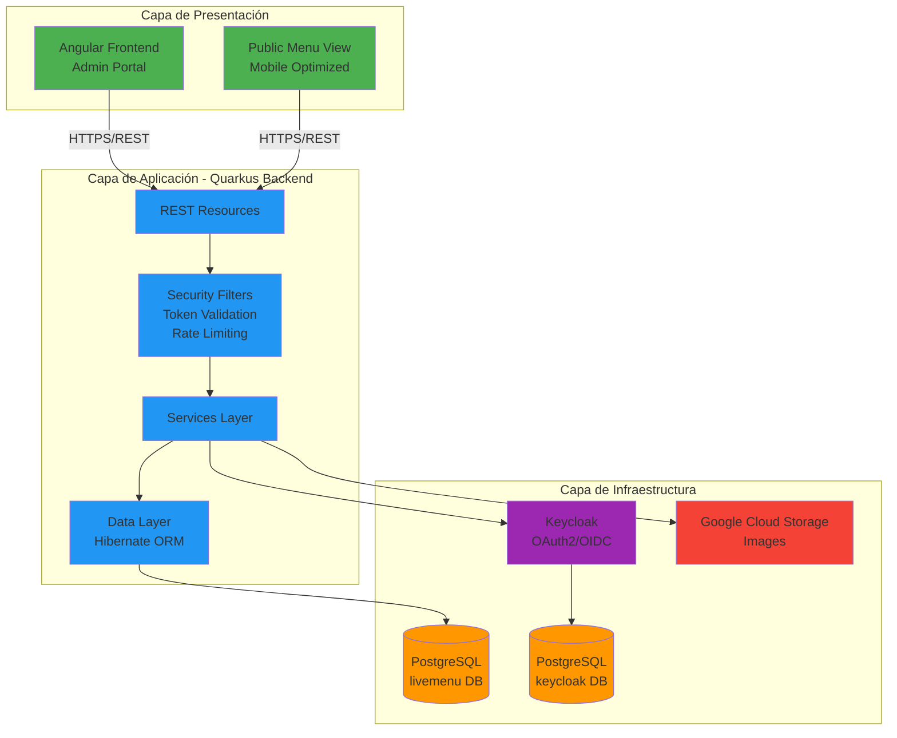
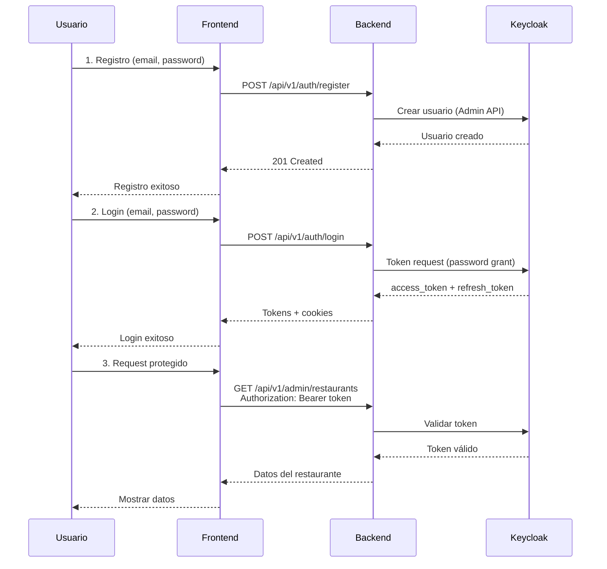
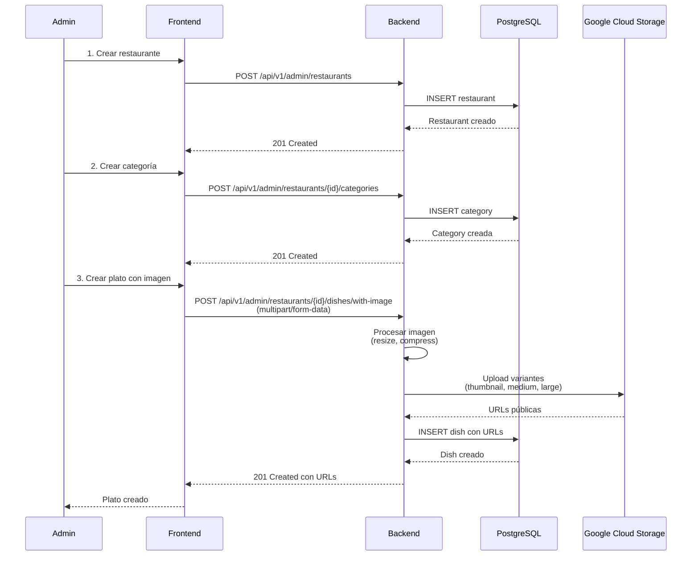
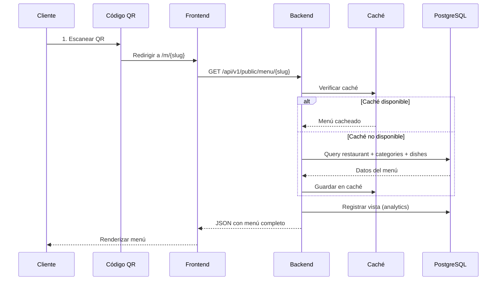
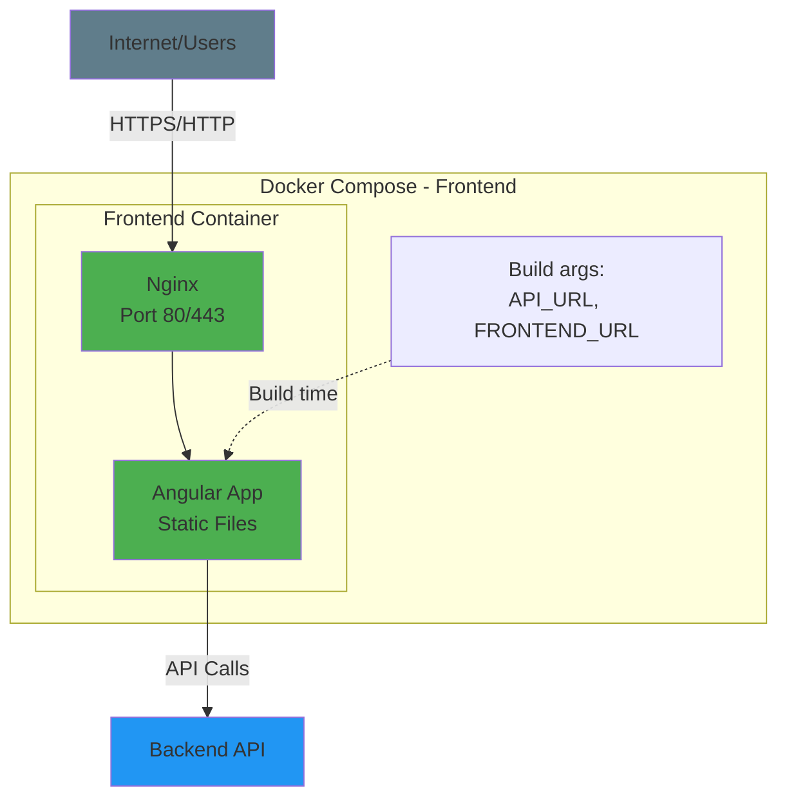

# Diagramas de Arquitectura – LiveMenu

Este documento contiene diagramas de la arquitectura del sistema LiveMenu en formato Mermaid. El **frontend** (este repositorio) es el Admin Portal y la Vista Pública del menú; el backend es Quarkus + Keycloak + PostgreSQL.

## Contexto: este repositorio (Frontend)

Este repo incluye:

- **Angular (Admin Portal):** login, restaurantes, categorías, platos, QR, analytics.
- **Vista pública del menú:** rutas `/m/:slug` y `/m/:slug/dish/:dishId`, optimizada para móvil y acceso por QR.

Todas las peticiones de datos van al backend vía `API_URL` configurada en `.env`.

---

## Diagrama de Componentes (sistema completo)

---

## Flujo de autenticación (Frontend ↔ Backend)

En el frontend, el token se guarda en `localStorage` (`livemenu_access_token`) y se envía mediante el `AuthInterceptor`. El refresh se hace con `POST /api/v1/auth/refresh` cuando el backend responde 401.

---

## Flujo de gestión de menú (Admin)

---

## Flujo de vista pública (menú por QR)

La URL del QR apunta a `FRONTEND_URL/m/{slug}` (configurada en `.env` como `FRONTEND_URL`).

---

## Diagrama de deployment del frontend (Docker)

El backend, Keycloak y PostgreSQL se despliegan por separado; este repo solo construye y sirve el frontend con Nginx.

---

## Convenciones de color en los diagramas

- **Verde (#4CAF50):** Frontend / Cliente
- **Azul (#2196F3):** Backend / Aplicación
- **Naranja (#FF9800):** Base de datos
- **Morado (#9C27B0):** Autenticación (Keycloak)
- **Rojo (#F44336):** Almacenamiento externo / Errores
- **Gris (#607D8B):** Infraestructura / Red

---

## Cómo visualizar los diagramas

Los diagramas están en formato Mermaid y se pueden ver en:

- **GitHub / GitLab:** renderizado automático en `.md`
- **VS Code:** extensión "Markdown Preview Mermaid Support"
- **Online:** [mermaid.live](https://mermaid.live)

---